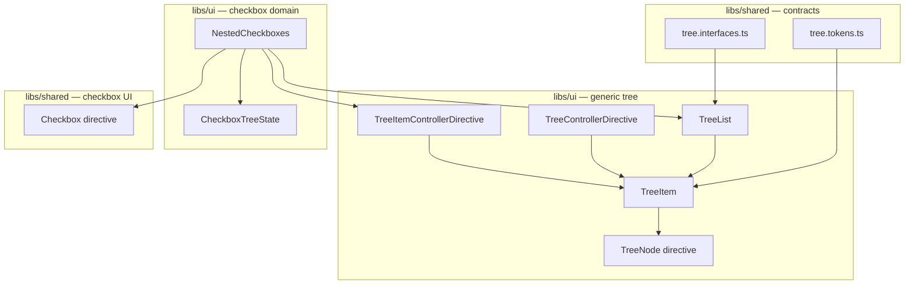
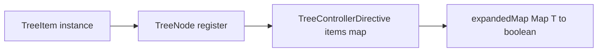

# ADR 0001: Generic Tree Architecture

## Status

Accepted

## Context

The original nested checkbox implementation (`CheckboxesList`) combined three concerns in one place:

1. **Recursive tree rendering** — the component rendered itself for each level of children.
2. **Checkbox UI** — inputs, labels, and indeterminate display.
3. **Tri-state selection** — parent `checked: null`, cascade on toggle, mixed-child detection.

That coupling caused several problems:

- The tree could not be reused for non-checkbox UI (folder views, icon trees, etc.).
- Selection logic lived in template-bound code (`uiMapper` pipe, inline `flatten()` helpers) and was hard to unit test.
- Expansion was always-on; there was no way for a parent to own which nodes stay open.
- Debug code (`console.log`, side effects during pipe evaluation) had accumulated in the old path.

We need a tree foundation that separates rendering, expansion, and (where applicable) selection — and that can support both simple demos and parent-owned expansion state.

### What changed (before → after)

| Aspect | Before (`CheckboxesList`) | After |
| --- | --- | --- |
| Tree structure | Checkbox-specific recursive component | Generic `TreeList` + consumer template |
| Expansion | Always visible | Supported via controller directives |
| Selection state | Inline in component + pipe | `CheckboxTreeState` class |
| State storage | `Map<ICheckbox, boolean>` keyed by object refs | `Map<number, boolean>` keyed by leaf `id` |
| Reusability | Checkbox-only | Tree usable for any hierarchical UI |
| Testability | Logic tied to templates | State and tree behavior unit-tested |

## Decision

Introduce a generic tree renderer with a registration / accessor / controller layer:

- Shared tree contracts live in `libs/shared/src/lib/tree`.
- `TreeList<T>` renders recursive data and delegates node appearance to a consumer `TemplateRef`.
- Consumers provide `childrenAccessor` so the renderer is not tied to a `children` property.
- `TreeItem` represents each rendered row and asks the active controller whether it is expanded.
- `TreeNode` registers each `TreeItem` instance with its source data value (needed for controlled expansion).
- `TreeControllerDirective` supports **controlled** expansion with an external `Map<T, boolean>`.
- `TreeItemControllerDirective` supports **uncontrolled** expansion with a `WeakMap<TreeItem, boolean>`.
- Checkbox tri-state and cascade behavior remain separate in `CheckboxTreeState`.

## Architecture overview



### Layer responsibilities

| Layer | Responsibility |
| --- | --- |
| `TreeList` / `TreeItem` | Recursive rendering, ARIA roles, template delegation |
| Controller directives | Expand / collapse (controlled or uncontrolled) |
| `TreeNode` directive | Register each rendered item with its source data value |
| `CheckboxTreeState` | Tri-state selection, cascade, indeterminate derivation |
| `Checkbox` directive | Sync DOM `indeterminate` when the form value is `null` |

**Important:** expansion and selection are independent. A parent can use controlled expansion with `CheckboxTreeState`, or either feature on its own.

## Controller DI wiring

Expansion behavior is pluggable through Angular's injector hierarchy. `TreeItem` and `TreeList` do not hard-code which controller is active.

### Injection tokens

| Token | Purpose | Default |
| --- | --- | --- |
| `TREE_CONTROLLER` | `isExpanded(item)` and `toggle(item)` | Always expanded; toggle is a no-op |
| `TREE_ACCESSOR` | `register(item, value)` / `unregister(item)` | None (optional) |

Both tokens are defined in `libs/shared/src/lib/tree/tree.tokens.ts`.

### Who injects what

- **`TreeItem`** injects `TREE_CONTROLLER`. It always passes **`this`** (the component instance) to the controller — never the raw data node.
- **`TreeNode`** optionally injects `TREE_ACCESSOR`. When present, it registers `(TreeItem instance → data value)` on create/update and unregisters on destroy.
- **Controller directives** are placed on the root `lib-tree-list`. Nested `lib-tree-list` instances inherit the same providers, so deep rows use the same controller.



### Toggle flow

1. The consumer template calls `toggle()` from the node context.
2. `TreeItem.toggle()` calls `controller.toggle(this)`.
3. The active controller updates its state (internal WeakMap or external `expandedMap`).
4. `TreeItem.isExpanded` re-evaluates.
5. `TreeList` renders or removes the nested child list based on `item.isExpanded` (children are removed from the DOM when collapsed, not just hidden).

### Two controller directives, one attribute

Both directives bind to `[libTreeController]`. Angular selects one based on whether `[expandedMap]` is also present:

| Mode | Selector | Provides | State storage |
| --- | --- | --- | --- |
| Uncontrolled | `[libTreeController]:not([expandedMap])` | `TREE_CONTROLLER` only | `WeakMap<TreeItem, boolean>` |
| Controlled | `[libTreeController][expandedMap]` | `TREE_CONTROLLER` + `TREE_ACCESSOR` | Parent's `Map<T, boolean>` |

`[libTreeController]="true"` or `"false"` sets the **fallback** default when no explicit state exists (default expanded vs default collapsed).

## Why `TreeNode` exists

`TreeNode` is the **registration bridge** between a `TreeItem` component instance and the domain data object (`T`).

### The mismatch it solves

- `TreeItem` always calls `controller.toggle(this)` and `controller.isExpanded(this)` — the API uses **component instances**.
- In controlled mode, expansion state lives in **`expandedMap: Map<T, boolean>`** — keyed by **data objects**, not components.

`TreeControllerDirective` therefore keeps an internal map `Map<TreeItem, T>`. `TreeNode` fills that map:

```text
TreeNode.ngOnChanges  →  accessor.register(treeItem, dataNode)
TreeNode.ngOnDestroy   →  accessor.unregister(treeItem)
```

Without registration, controlled toggle would not know which `expandedMap` entry to read or write.

### Why not pass `node` directly from `TreeItem`?

`TreeItem` already has a `[node]` input, but the shared `TreeController` interface intentionally uses `TreeItem` instances so that **uncontrolled** mode can key state by component instance (`WeakMap<TreeItem, boolean>`). `TreeNode` keeps one stable controller API and limits the instance→data mapping to controlled mode only.

### When is it actually used?

| Mode | `TREE_ACCESSOR` | `TreeNode` effect |
| --- | --- | --- |
| Uncontrolled | Not provided | No-op (registration calls are skipped) |
| Controlled | Provided by `TreeControllerDirective` | Required for correct expand/collapse and `(toggled)` events |

The directive stays on the template in both modes so consumers use one consistent markup shape.

## Controlled vs uncontrolled expansion

**Controlled expansion** means the **parent component owns** which nodes are expanded. The tree reads and updates that state; it does not keep the source of truth internally.

This is the same idea as a controlled form input: the parent holds the value; the child displays and emits changes.

### Uncontrolled (internal state)

```html
<lib-tree-list
  [libTreeController]="true"
  [nodes]="nodes"
  [nodeTemplate]="nodeTemplate"
  [childrenAccessor]="childrenAccessor"
/>
```

- State lives inside `TreeItemControllerDirective`.
- The parent only chooses a default (`true` = start expanded, `false` = start collapsed).
- Use for demos and simple UI where open/closed state does not need to persist or sync elsewhere.

`NestedCheckboxes` uses this mode today.

### Controlled (external state)

```html
<lib-tree-list
  [libTreeController]="false"
  [expandedMap]="expandedMap"
  [nodes]="nodes"
  [nodeTemplate]="nodeTemplate"
  [childrenAccessor]="childrenAccessor"
  (toggled)="onNodeToggled($event)"
/>
```

```typescript
readonly expandedMap = new Map<MyNode, boolean>();

onNodeToggled(node: MyNode): void {
  // expandedMap was already updated by TreeControllerDirective.toggle()
  // use this hook to persist, sync routing, etc.
}
```

- State lives in the parent's `expandedMap`.
- `(toggled)` emits the **data node** `T`, not the `TreeItem` instance.
- Use when you need persist, expand-all / collapse-all, restore after reload, or URL sync.

### Map key identity

`expandedMap` is keyed by **object reference**. The same object instances passed in `[nodes]` must be used as keys. If the tree data is rebuilt with new object instances, map entries will not apply unless the consumer remaps by a stable id (e.g. `node.id`).

## Checkbox selection (`CheckboxTreeState`)

Checkbox logic is fully separate from tree expansion. `CheckboxTreeState` owns checked / unchecked / indeterminate behavior.

Location: `libs/ui/src/lib/components/nested-checkboxes/checkbox-tree.state.ts`.

### Leaf-only storage

Internal state is `Map<number, boolean>` — **only leaf nodes** (nodes with no children) are stored, keyed by `id`.

On init (`reset`), each leaf's `checked === true` becomes selected; `false` and `null` both become not selected. Parent `checked` values in input data are **derived after init**, not stored as authoritative state.

### Deriving tri-state (`getState`)

For any node:

1. Collect all descendant **leaves** (`leavesOf`).
2. Read the first leaf's boolean from the selection map.
3. If every leaf matches that value → return `true` or `false`.
4. If any leaf differs → return `null` (indeterminate).

Examples:

| Node | Leaf states | `getState()` |
| --- | --- | --- |
| Single leaf | `[true]` | `true` |
| Parent with mixed children | `[true, false]` | `null` |
| Parent, all selected | `[true, true, true]` | `true` |

### Cascade (`toggle`)

`t toggle(node, value)` sets **every descendant leaf** to the same boolean. Toggling a leaf updates only that leaf. Parent state is never stored; it is recomputed on the next `getState()`.

### Template wiring

```html
<input
  uiCheckbox
  type="checkbox"
  [ngModel]="checkboxState.getState(node)"
  (ngModelChange)="checkboxState.toggle(node, $event)"
/>
```

The `uiCheckbox` directive sets `input.indeterminate = true` when the form value is `null`. It uses `startWith(control.value)` so indeterminate state is correct on first render, not only after user interaction.

### Combining with controlled expansion

Use both on the same `lib-tree-list`: `[expandedMap]` for open/closed rows, `CheckboxTreeState` for checkboxes. Neither layer knows about the other.

## Wiring a controlled tree from a parent

Minimal checklist:

1. Create and own `expandedMap = new Map<T, boolean>()`.
2. Put `TreeControllerDirective` on `lib-tree-list` with both `[libTreeController]` and `[expandedMap]`.
3. Provide `[nodes]`, `[nodeTemplate]`, and `[childrenAccessor]`.
4. Call `toggle()` from the template for expand/collapse UI (or rely on programmatic map updates).
5. Listen to `(toggled)` for side effects (persist, analytics, etc.).
6. Optionally call `expandedMap.set(node, true)` in `expandAll()` or `clear()` in `collapseAll()`.

Reference implementation: `libs/ui/src/lib/components/tree-list/tree-list.spec.ts` (`ControlledHost`).

## Removed or replaced

| Removed | Replaced by |
| --- | --- |
| `CheckboxesList` | `TreeList` + node template + `CheckboxTreeState` |
| `uiMapperPipe` | Direct calls to `CheckboxTreeState` from the template |
| Inline `flatten()` / map mutation in pipe eval | `CheckboxTreeState.leavesOf()` and explicit `toggle()` |

## Consequences

### Benefits

- The tree renderer can be reused for checkbox trees, icon trees, folder trees, and other hierarchical displays without checkbox-specific fields or logic.
- Expansion and selection are modeled independently, which keeps checkbox code simpler.
- Consumers can choose uncontrolled expansion (simple) or controlled expansion (parent-owned state).
- Selection and tree behavior are unit-tested outside templates.

### Trade-offs

- More moving parts than a single recursive component: tokens, two controller directives, and `TreeNode` registration.
- Slightly more setup for consumers (template, accessor, optional controller).
- Controlled `expandedMap` uses object identity unless the consumer adds id-based persistence on top.

The extra structure is accepted to support reusable tree behavior and clear separation of concerns.
