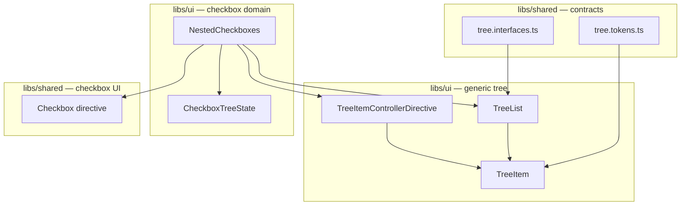

# ADR 0001: Generic Tree Architecture

## Status

Accepted

## Context

The original nested checkbox implementation (`CheckboxesList`) combined three concerns in one place:

1. **Recursive tree rendering** — the component rendered itself for each level of children.
2. **Checkbox UI** — inputs, labels, and indeterminate display.
3. **Tri-state selection** — parent `checked: null`, cascade on toggle, mixed-child detection.

That coupling caused several problems:

- The tree could not be reused for non-checkbox UI (folder views, icon trees, etc.).
- Selection logic lived in template-bound code (`uiMapper` pipe, inline `flatten()` helpers) and was hard to unit test.
- Expansion was always-on; there was no way for a parent to own which nodes stay open.
- Debug code (`console.log`, side effects during pipe evaluation) had accumulated in the old path.

We need a tree foundation that separates rendering, expansion, and (where applicable) selection — and that can support both simple demos and parent-owned expansion state when that need arises.

### What changed (before → after)

| Aspect | Before (`CheckboxesList`) | After |
| --- | --- | --- |
| Tree structure | Checkbox-specific recursive component | Generic `TreeList` + consumer template |
| Expansion | Always visible | Supported via `TreeItemControllerDirective` |
| Selection state | Inline in component + pipe | `CheckboxTreeState` class |
| State storage | `Map<ICheckbox, boolean>` keyed by object refs | `Map<number, boolean>` keyed by leaf `id` |
| Reusability | Checkbox-only | Tree usable for any hierarchical UI |
| Testability | Logic tied to templates | State and tree behavior unit-tested |

## Decision

Introduce a generic tree renderer with a pluggable controller layer:

- Shared tree contracts live in `libs/shared/src/lib/tree`.
- `TreeList<T>` renders recursive data and delegates node appearance to a consumer `TemplateRef`.
- Consumers provide `childrenAccessor` so the renderer is not tied to a `children` property.
- `TreeItem` represents each rendered row and asks the active controller whether it is expanded.
- `TreeItemControllerDirective` stores expansion in a `WeakMap<TreeItem, boolean>` (uncontrolled mode).
- Checkbox tri-state and cascade behavior remain separate in `CheckboxTreeState`.

Controlled expansion (parent-owned `Map<T, boolean>`) was prototyped but removed as unused. See [Future: controlled expansion](#future-controlled-expansion-not-implemented) for the approach if we need it later.

## Architecture overview



### Layer responsibilities

| Layer | Responsibility |
| --- | --- |
| `TreeList` / `TreeItem` | Recursive rendering, ARIA roles, template delegation |
| `TreeItemControllerDirective` | Expand / collapse with internal state |
| `CheckboxTreeState` | Tri-state selection, cascade, indeterminate derivation |
| `Checkbox` directive | Sync DOM `indeterminate` when the form value is `null` |

**Important:** expansion and selection are independent. A parent can add controlled expansion later (see below) alongside `CheckboxTreeState`, or use either feature on its own.

## Controller DI wiring

Expansion behavior is pluggable through Angular's injector hierarchy. `TreeItem` and `TreeList` do not hard-code which controller is active.

### Injection tokens

| Token | Purpose | Default |
| --- | --- | --- |
| `TREE_CONTROLLER` | `isExpanded(item)` and `toggle(item)` | Always expanded; toggle is a no-op |

Defined in `libs/shared/src/lib/tree/tree.tokens.ts`.

### Who injects what

- **`TreeItem`** injects `TREE_CONTROLLER`. It always passes **`this`** (the component instance) to the controller — never the raw data node.
- **`TreeItemControllerDirective`** is placed on the root `lib-tree-list`. Nested `lib-tree-list` instances inherit the same provider, so deep rows use the same controller.

### Toggle flow

1. The consumer template calls `toggle()` from the node context.
2. `TreeItem.toggle()` calls `controller.toggle(this)`.
3. The controller updates its internal `WeakMap<TreeItem, boolean>`.
4. `TreeItem.isExpanded` re-evaluates.
5. `TreeList` renders or removes the nested child list based on `item.isExpanded` (children are removed from the DOM when collapsed, not just hidden).

### Uncontrolled expansion (current)

```html
<lib-tree-list
  [libTreeController]="true"
  [nodes]="nodes"
  [nodeTemplate]="nodeTemplate"
  [childrenAccessor]="childrenAccessor"
/>
```

- State lives inside `TreeItemControllerDirective`.
- The parent only chooses a default (`true` = start expanded, `false` = start collapsed).
- Use for demos and simple UI where open/closed state does not need to persist or sync elsewhere.

`NestedCheckboxes` uses this mode today.

## Future: controlled expansion (not implemented)

We removed the controlled-expansion layer (`TreeControllerDirective`, `TreeNode` registration, `TREE_ACCESSOR`) because nothing in the library consumed it yet. The same design can be reintroduced when a parent must own which nodes are expanded.

This is the same idea as a controlled form input: the parent holds the value; the tree displays and emits changes.

### What it would enable

| Capability | How |
| --- | --- |
| Persist open nodes after reload | Parent stores `Map<T, boolean>` (or id-based map) and passes it in |
| Expand all / collapse all | Parent calls `expandedMap.set(node, true)` or `expandedMap.clear()` |
| URL or route sync | Parent updates `expandedMap` from query params and listens to toggle events |
| Side effects on toggle | `(toggled)` output emits the **data node** `T`, not the `TreeItem` instance |

### Sketch of the approach

1. **Parent-owned state:** `expandedMap: Map<T, boolean>` keyed by data object reference (same instances as `[nodes]`).
2. **Registration bridge:** `TreeItem` calls `controller.toggle(this)` using component instances, but controlled state is keyed by `T`. A `TreeNode` directive (or similar) registers `(TreeItem → T)` on create/destroy via a `TREE_ACCESSOR` token.
3. **Controller directive:** Implements both `TreeController` (read/write `expandedMap`) and `TreeAccessor` (maintains `Map<TreeItem, T>`).
4. **Toggle:** Resolve `TreeItem` → `T`, flip `expandedMap.get(T)`, emit `(toggled)` with `T`.
5. **Default when missing:** `[libTreeController]="false"` as fallback when a node has no map entry (start collapsed).

Example wiring if re-added:

```html
<lib-tree-list
  [libTreeController]="false"
  [expandedMap]="expandedMap"
  [nodes]="nodes"
  [nodeTemplate]="nodeTemplate"
  [childrenAccessor]="childrenAccessor"
  (toggled)="onNodeToggled($event)"
/>
```

```typescript
readonly expandedMap = new Map<MyNode, boolean>();

onNodeToggled(node: MyNode): void {
  // expandedMap already updated by the controller; persist, sync routing, etc.
}
```

**Map key identity:** `expandedMap` would be keyed by **object reference**. If tree data is rebuilt with new object instances, map entries would not apply unless the consumer remaps by a stable id (e.g. `node.id`).

**Combining with checkboxes:** Controlled expansion and `CheckboxTreeState` are orthogonal — one layer for open/closed rows, one for selection. Neither needs to know about the other.

## Checkbox selection (`CheckboxTreeState`)

Checkbox logic is fully separate from tree expansion. `CheckboxTreeState` owns checked / unchecked / indeterminate behavior.

Location: `libs/ui/src/lib/components/nested-checkboxes/checkbox-tree.state.ts`.

### Leaf-only storage

Internal state is `Map<number, boolean>` — **only leaf nodes** (nodes with no children) are stored, keyed by `id`.

On init (`reset`), each leaf's `checked === true` becomes selected; `false` and `null` both become not selected. Parent `checked` values in input data are **derived after init**, not stored as authoritative state.

### Deriving tri-state (`getState`)

For any node:

1. Collect all descendant **leaves** (`leavesOf`).
2. Read the first leaf's boolean from the selection map.
3. If every leaf matches that value → return `true` or `false`.
4. If any leaf differs → return `null` (indeterminate).

Examples:

| Node | Leaf states | `getState()` |
| --- | --- | --- |
| Single leaf | `[true]` | `true` |
| Parent with mixed children | `[true, false]` | `null` |
| Parent, all selected | `[true, true, true]` | `true` |

### Cascade (`toggle`)

`toggle(node, value)` sets **every descendant leaf** to the same boolean. Toggling a leaf updates only that leaf. Parent state is never stored; it is recomputed on the next `getState()`.

### Template wiring

```html
<input
  uiCheckbox
  type="checkbox"
  [ngModel]="checkboxState.getState(node)"
  (ngModelChange)="checkboxState.toggle(node, $event)"
/>
```

The `uiCheckbox` directive sets `input.indeterminate = true` when the form value is `null`. It uses `startWith(control.value)` so indeterminate state is correct on first render, not only after user interaction.

## Removed or replaced

| Removed | Replaced by |
| --- | --- |
| `CheckboxesList` | `TreeList` + node template + `CheckboxTreeState` |
| `uiMapperPipe` | Direct calls to `CheckboxTreeState` from the template |
| Inline `flatten()` / map mutation in pipe eval | `CheckboxTreeState.leavesOf()` and explicit `toggle()` |
| `TreeControllerDirective` / `TreeNode` / `TREE_ACCESSOR` | Deferred; see [Future: controlled expansion](#future-controlled-expansion-not-implemented) |

## Consequences

### Benefits

- The tree renderer can be reused for checkbox trees, icon trees, folder trees, and other hierarchical displays without checkbox-specific fields or logic.
- Expansion and selection are modeled independently, which keeps checkbox code simpler.
- Uncontrolled expansion covers current use cases with minimal setup.
- Selection and tree behavior are unit-tested outside templates.

### Trade-offs

- Parent-owned expansion is not available until the controlled layer is reintroduced.
- Slightly more setup for consumers than a single recursive component (template, accessor, controller directive).

The structure is accepted to support reusable tree behavior and clear separation of concerns, with a documented path to controlled expansion when needed.
